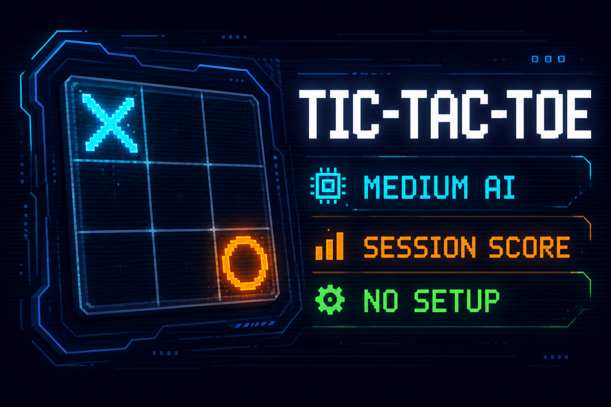
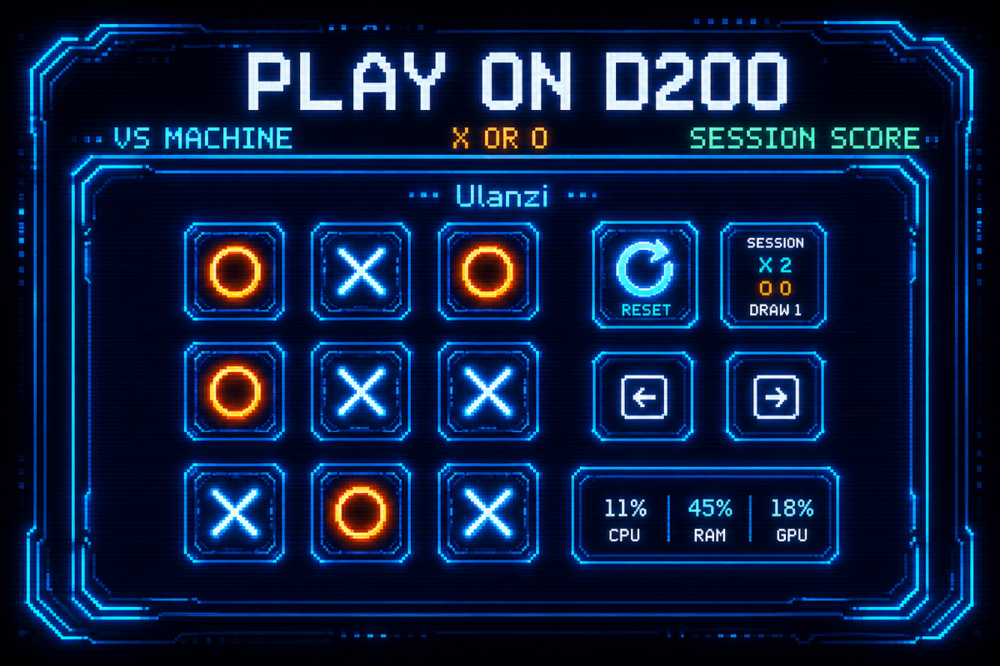

# Tic-Tac-Toe for Ulanzi D200

Play a complete game of tic-tac-toe on a Ulanzi D200. The plugin uses **11 button actions**: nine fixed board cells, one **New Game** button, and one **Session Score** button. Choose **X** or **O** and play against the machine.

## Key layout

Place the cell actions in row-major order:

```text
┌────────┬────────┬────────┐
│ Cell 1 │ Cell 2 │ Cell 3 │
├────────┼────────┼────────┤
│ Cell 4 │ Cell 5 │ Cell 6 │
├────────┼────────┼────────┤
│ Cell 7 │ Cell 8 │ Cell 9 │
└────────┴────────┴────────┘
```

The nine placement icons retain the position number and miniature grid to make setup unambiguous. Once configured, every cell switches among deterministic 196×196 runtime derivatives of the source artwork in `assets/blank.png`, `assets/cross.png`, and `assets/circle.png`. The build keeps the original artwork unchanged and packages only the optimized derivatives.

The **New Game** action normally shows the supplied New Game artwork. A human win or loss temporarily replaces it with the supplied Victory or Defeat artwork for exactly two seconds, then restores New Game. Draws keep New Game visible. These images are also deterministic 196×196 derivatives; their workspace source files remain unchanged and are excluded from the runnable plugin and ZIP.

## Install the release package

1. Download `com.ulanzi.tictactoe.ulanziPlugin.zip` from the GitHub release assets and extract it.
2. Install the contained `com.ulanzi.tictactoe.ulanziPlugin` folder using Ulanzi Studio's local plugin selection, or copy that folder to `%APPDATA%\Ulanzi\UlanziDeck\Plugins\` using the locally verified installation method.
3. Place **Cell 1** through **Cell 9** as shown above, then add **New Game** and **Session Score** wherever convenient.
4. Select the **New Game** action, open its Property Inspector, and choose **X / crosses** or **O / circles**.

The release ZIP is a transport archive. Extract it first; direct ZIP import has not been established by the local installation test.

The package targets the Ulanzi D200 keypad on Windows 10 or newer and requires Ulanzi Studio 2.1.4 or newer. It does not support other devices unless their host exposes the same D200 action contract.

## Store gallery

The store gallery includes the original promotional banner and a second gameplay banner based on an authorized D200 screenshot. Both approved banners are also carried by the runnable package.





## Build the release package

1. Install Node.js 20 or newer.
2. Run `npm run check`, `npm test`, `npm run smoke`, and `npm run mock`.
3. Run `npm run package` last.

Packaging performs a final build and creates `com.ulanzi.tictactoe.ulanziPlugin/package/com.ulanzi.tictactoe.ulanziPlugin.zip`. The `package/` directory is ignored by Git; attach the ZIP to the GitHub release instead of committing it.

The symbol setting is stored through the Ulanzi action parameter mechanism. No external service is required. Each fixed action UUID identifies its board cell, so moving a configured action moves that cell's control rather than changing the game state.

Cell action identities use one direct suffix segment: `.cell-1` through `.cell-9` in row-major order.

## Gameplay

- The human uses the symbol selected on **New Game**; the machine uses the opposite symbol.
- X always starts a fresh round. Choose X to move first, or choose O for a machine-first round after the normal visible delay.
- Pressing **New Game** preserves the selected symbol and session score.
- The machine uses an approximately 75% optimal minimax / 25% random legal-move strategy.
- Cell input is locked while the machine is moving. Occupied cells and presses after a finished game are ignored.
- A win, draw, or final board remains visible until **New Game**. Winning marks deliberately keep the exact supplied X/O artwork; no fourth rendered variant or pixel-changing highlight is applied.
- **Session Score** counts X wins, O wins, and draws. Starting a new game does not reset it.

The game is process-local: all registered Tic-Tac-Toe actions connected to one plugin process show and control the same game. Restarting the plugin process resets the session score.

## Hardware limitation

The host protocol and package conventions mirror the verified Flight Info template. Automated tests cover game rules, AI selection, rendering, and context broadcasting, but final brightness, crop, and timing should still be verified on a physical D200 before marketplace submission.

## Artwork provenance and license

The repository owner and rightsholder supplied and authorized all high-resolution PNG source files in `assets/`, and their generated derivatives, for distribution under this repository's MIT License. The build preserves those source files and generates the runtime derivatives reproducibly. Placement icons, score artwork, and plugin artwork are generated by `scripts/assets.mjs`; approved store media is preserved byte-for-byte and copied into the runnable package where required. No third-party provenance is claimed for the supplied artwork.

The project code, included source artwork, and generated derivatives are available under the [MIT License](LICENSE).
